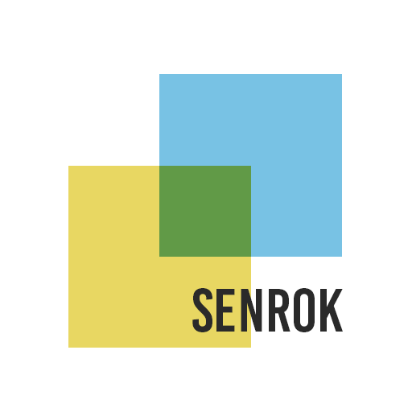

<b>A project of SENROK Open Source</b>

# Wechat-pay Go Kit

The Wechat-pay supported kit for Go.

---

## Table of contents

- [Features](#features)
- [Installation](#installation)
- [Get started](#get-started)
- [Documentation](#documentation)
- [Testing / Development](#testing--development)
- [Contribution](#contribution--guidelines)
- [License](#license)

---

## License

The Project is licensed under the Apache License.
